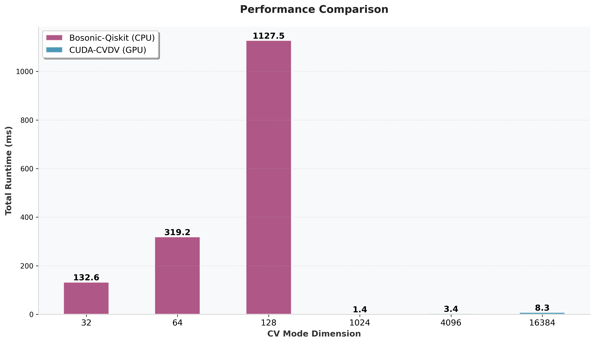
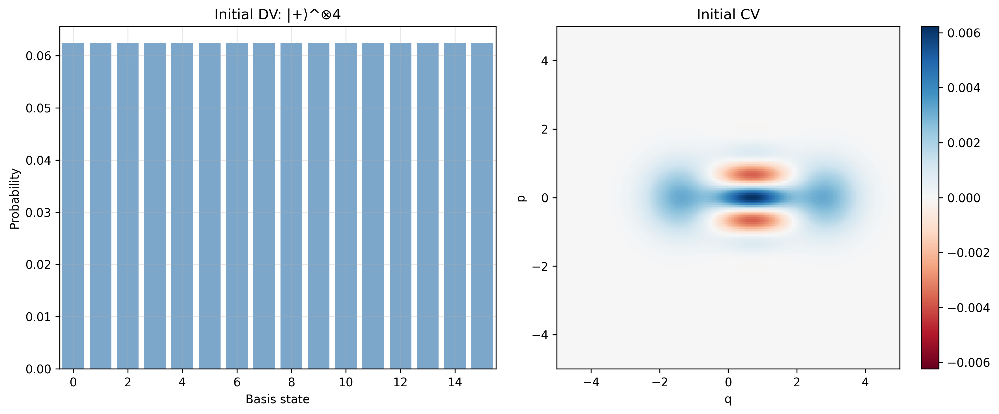
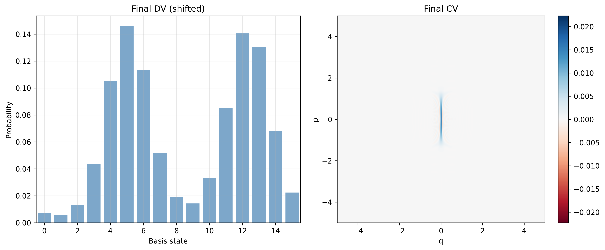
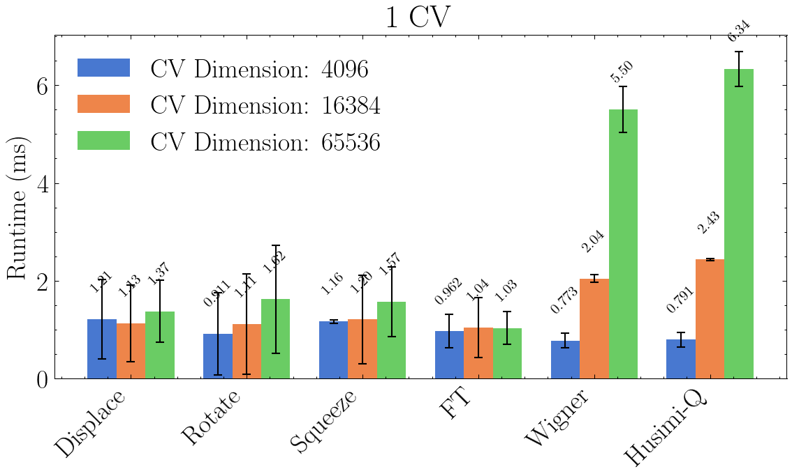
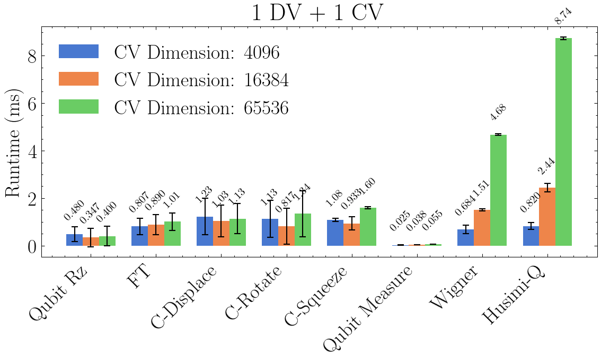
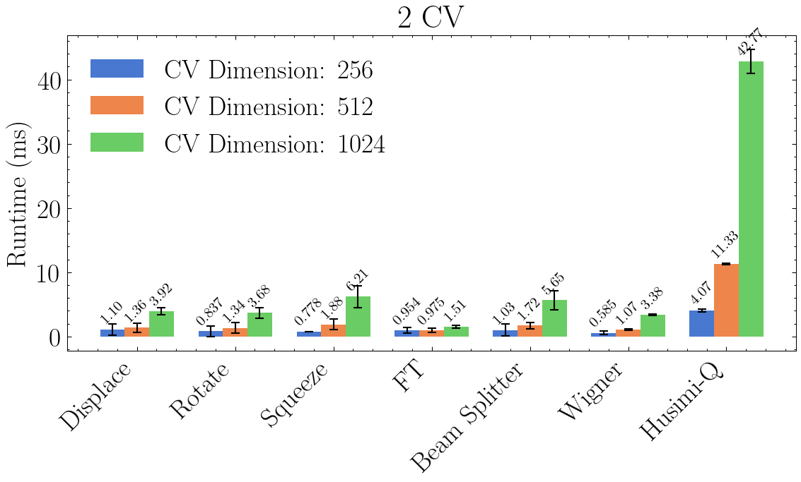
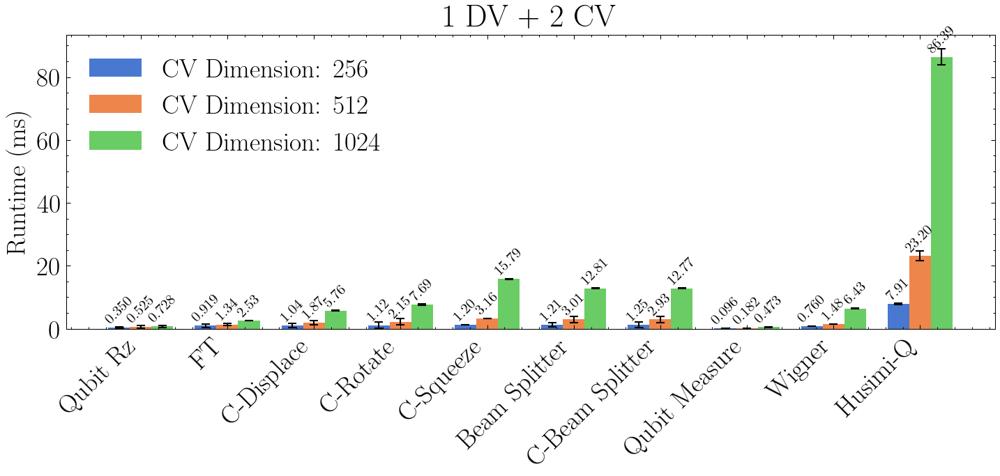

# Benchmarks

All benchmarks run on **NVIDIA RTX 4070 Laptop GPU**.

## CV-to-DV State Transfer

The position encoding approach enables universal transfer of CV modes into qubits, where $\\psi(q_j)$ are directly encoded into qubit register amplitudes ([Phys. Rev. Lett. 128, 110503 (2022)](https://link.aps.org/doi/10.1103/PhysRevLett.128.110503)):

$$|\\psi\\rangle_{\\text{CV}} = \\int \\psi(q) |q\\rangle dq \\mapsto \\sqrt{\\lambda} \\sum_{j=0}^{N-1} \\psi(\\lambda\\tilde{j}) |j\\rangle_{\\text{DV}}$$

### Performance vs bosonic-qiskit (CPU, Fock basis)



CUDA-CVDV scales efficiently to dimension **16384** (14 qubits) with **50× speedup** over bosonic-qiskit at dimension 128 (7 qubits). Bosonic-qiskit's runtime grows significantly beyond dimension 128 due to dense matrix operations in Fock basis.

### Cat State Transfer Visualization

**Initial State**



**Final State**



### Run

```bash
./benchmarks/state_transfer/run.sh
```

Results saved to `benchmarks/state_transfer/results/` (`benchmark_results.json` + plots).


## Gate Operation Benchmarks

Per-gate timing across different register configurations:

**1 CV mode**



**1 DV + 1 CV**



**2 CV modes**



**1 DV + 2 CV**



- FT: Continuous Fourier Transform (cuFFT-backed)
- C-{Displace, Squeeze, Rotate}: Conditional gates (DV-controlled CV operations)

### Run

```bash
./benchmarks/ops_time/run.sh
```

Results saved to `benchmarks/ops_time/results/` (`bench_ops.json` + per-gate plots).
