# CVDV Discretization Error Analysis

## Fock State Norm Check

## QFT Error

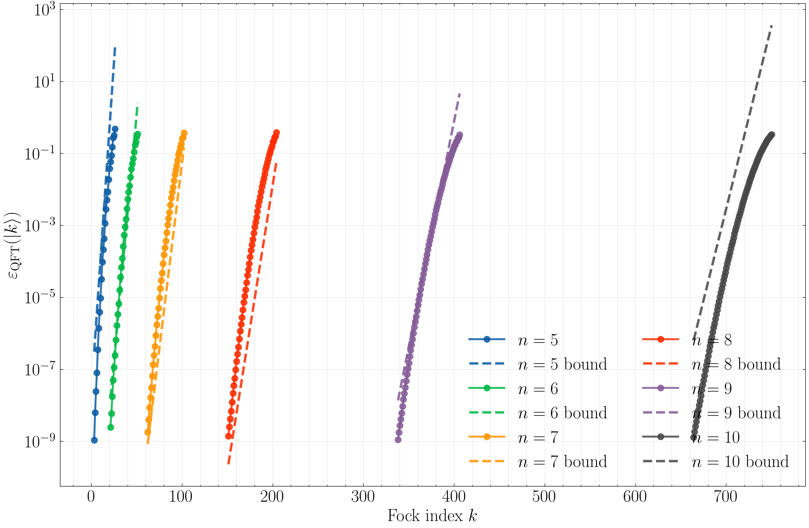
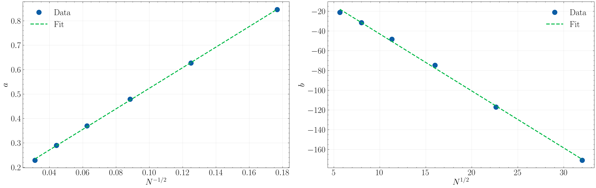

## QFT on Displaced Fock States

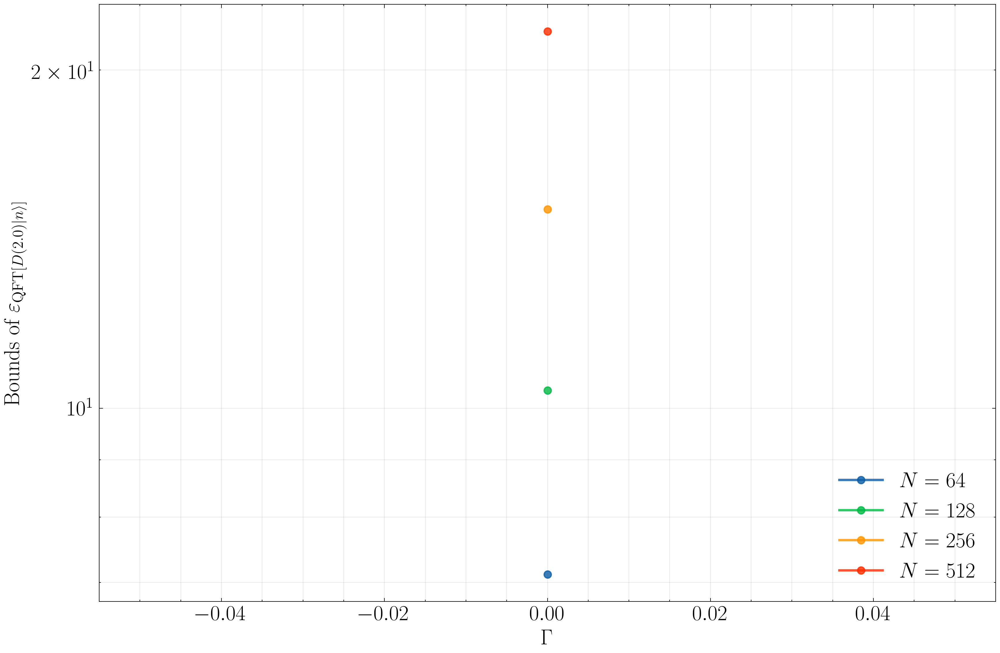

### Gate-parameter sweep (fixed N)

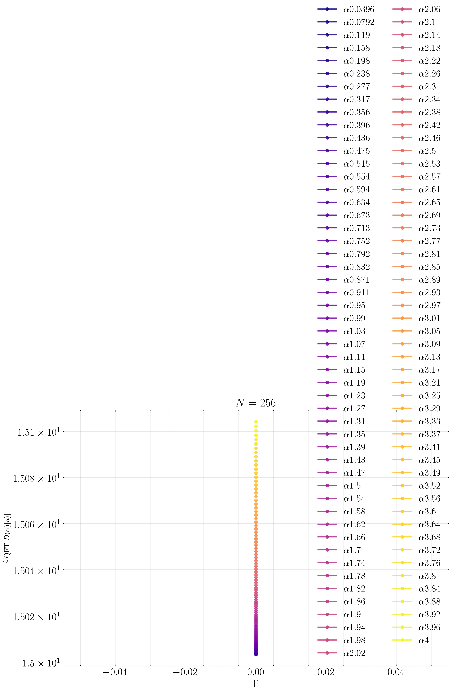
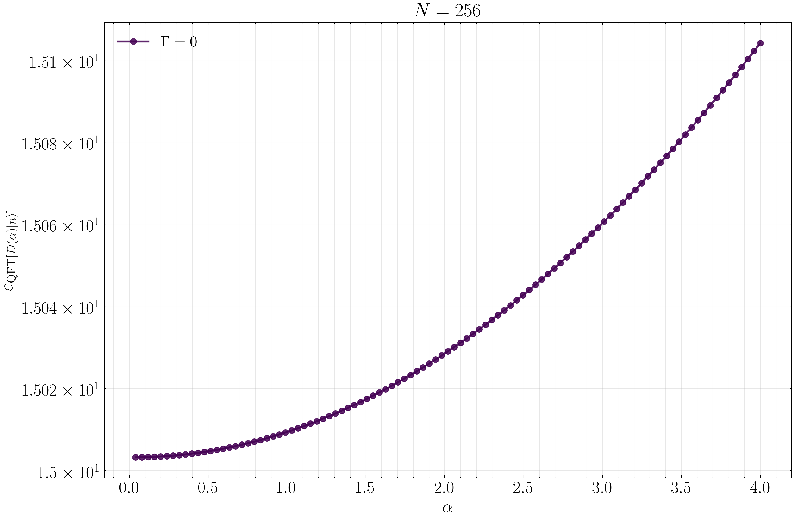

## QFT on Squeezed Fock States

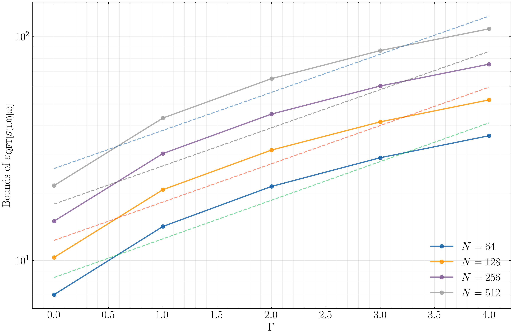
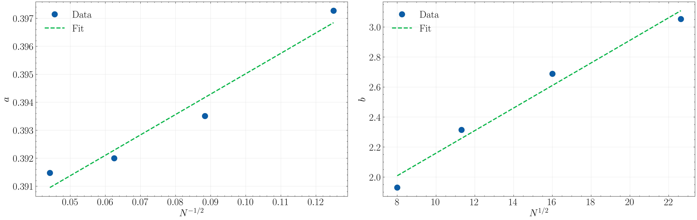

**Fitted formula** `log(eps) = a(N)*(Gamma+1/2) + b(N)`:

$$
\log \varepsilon \;\approx\; \Bigl(0.0729\,N^{-1/2} + 0.3877\Bigr)\,\Bigl(\Gamma+\tfrac{1}{2}\Bigr)\;+\; 0.0752\,N^{1/2} + 1.4076
$$

### Gate-parameter sweep (fixed N)

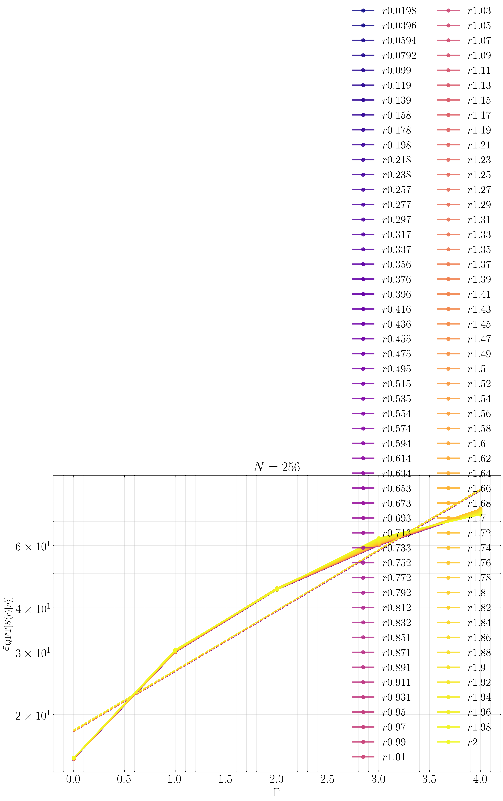
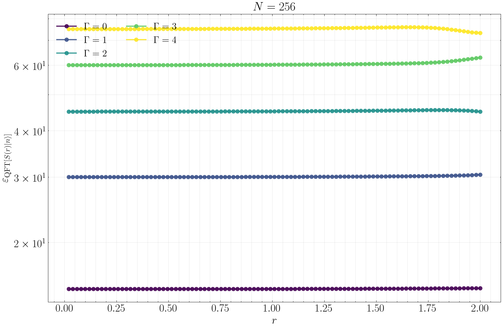

## Commutator Error

**Fitted formula** `log(eps) = a(N)*(Gamma+1/2) + b(N)`:

$$
\log \varepsilon \;\approx\; \Bigl(6.3275\,N^{-1/2} + 0.1203\Bigr)\,\Bigl(\Gamma+\tfrac{1}{2}\Bigr)\;+\; -7.8531\,N^{1/2} + 28.9305
$$

## Displacement D(2) Error

### Gate-parameter sweep (fixed N)

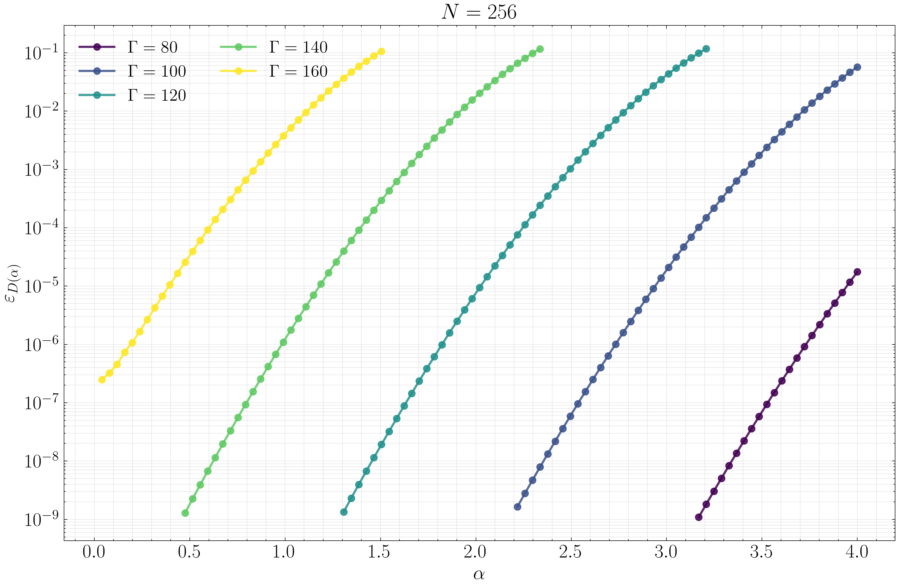

## Rotation R(pi/4) Error

### Gate-parameter sweep (fixed N)

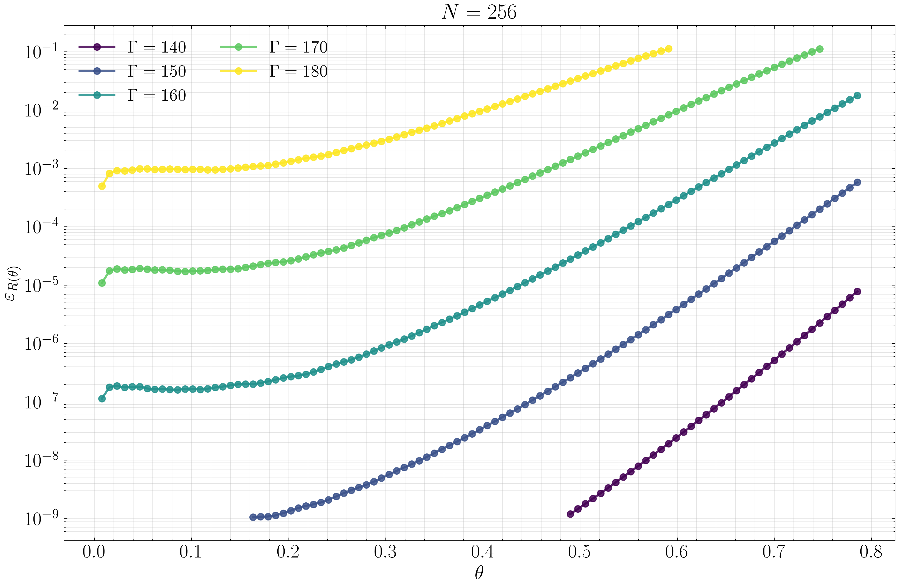

## Squeezing S(1) Error

### Gate-parameter sweep (fixed N)

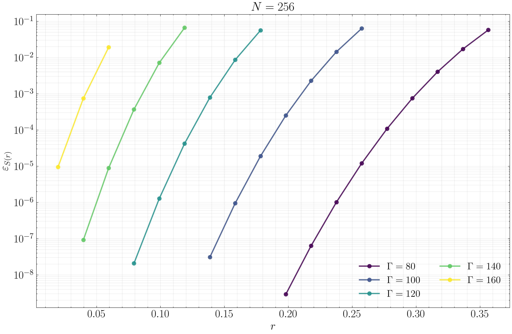

## Beam Splitter BS(pi/2) Error

### Gate-parameter sweep (fixed N)

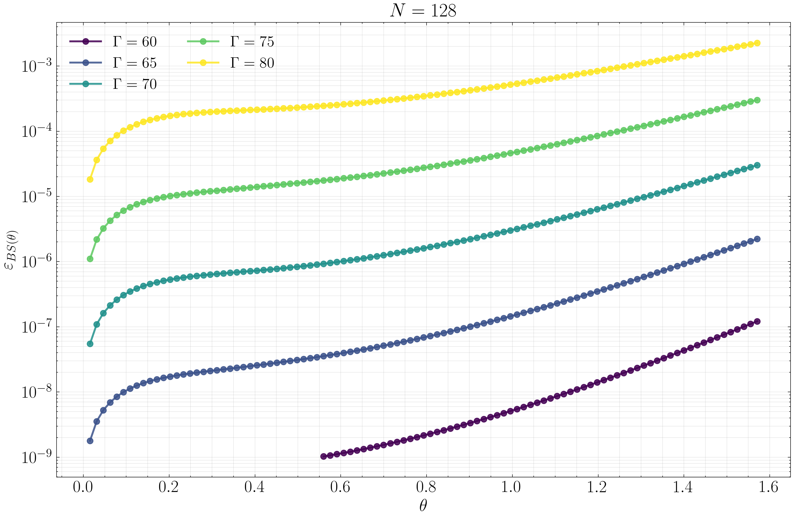

## Compare Fock vs WF Encoding

## Advantage Diagram

