# CVDV Discretization Error Analysis

## Fock State Norm Check

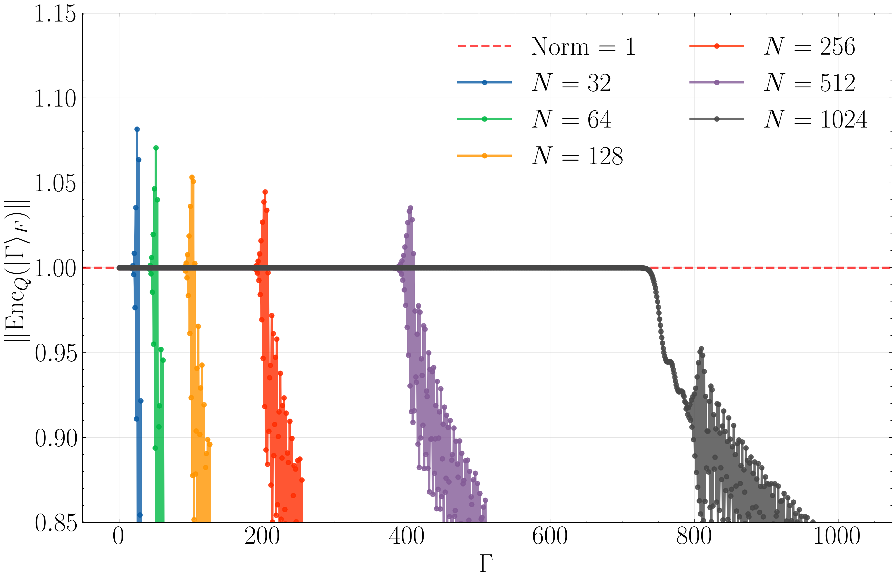

## QFT Error

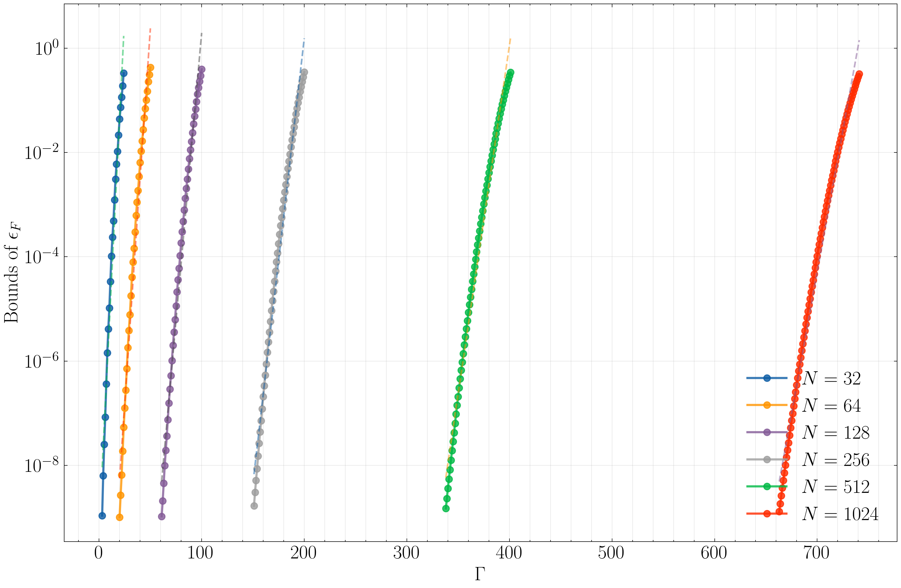
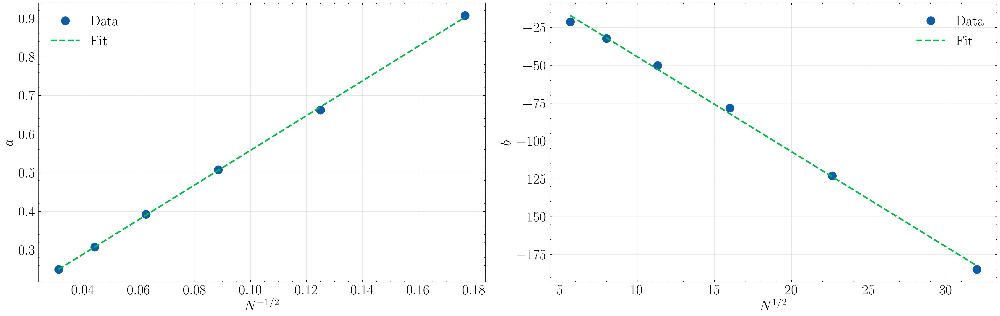

**Per-N linear fits** `log(ε) = a·Γ + b`:

| N | a | b |
|---|---|---|
| 32 | 9.0704e-01 | -21.2275 |
| 64 | 6.6208e-01 | -32.2294 |
| 128 | 5.0757e-01 | -50.0823 |
| 256 | 3.9266e-01 | -78.1000 |
| 512 | 3.0772e-01 | -122.9712 |
| 1024 | 2.4982e-01 | -184.7623 |

**Coefficient scaling**: a ≈ 4.4875·N⁻¹/² +0.1095  (R²=0.9997),  b ≈ -6.2736·N¹/²  +18.3953  (R²=0.9977)

## Commutator [q,p]=i Error

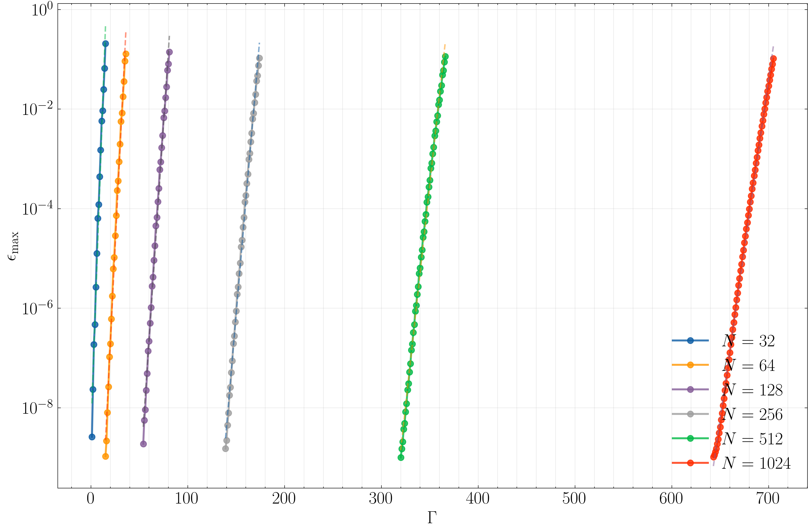
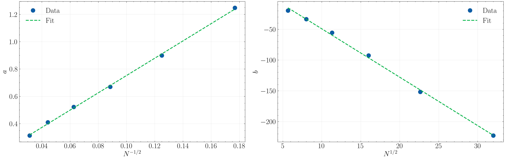

**Per-N linear fits** `log(ε) = a·Γ + b`:

| N | a | b |
|---|---|---|
| 32 | 1.2480e+00 | -19.4646 |
| 64 | 8.9930e-01 | -33.4088 |
| 128 | 6.6965e-01 | -55.4580 |
| 256 | 5.2261e-01 | -92.4668 |
| 512 | 4.1021e-01 | -151.6513 |
| 1024 | 3.1347e-01 | -222.6758 |

**Coefficient scaling**: a ≈ 6.3275·N⁻¹/² +0.1203  (R²=0.9992),  b ≈ -7.8685·N¹/²  +29.5153  (R²=0.9980)

## Displacement D(2) Error

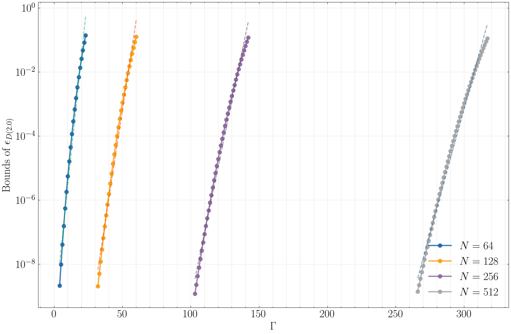
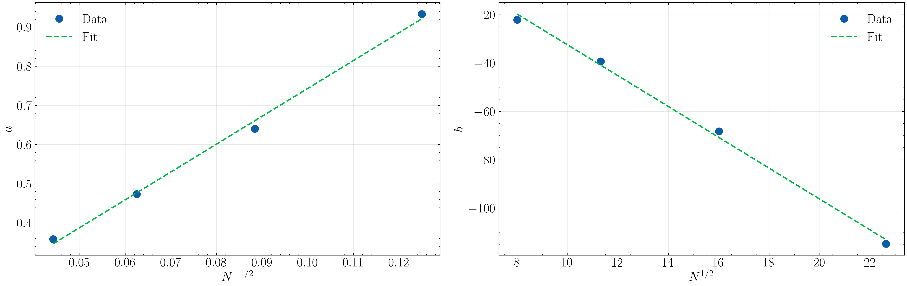

**Per-N linear fits** `log(ε) = a·Γ + b`:

| N | a | b |
|---|---|---|
| 64 | 9.3348e-01 | -22.0500 |
| 128 | 6.4024e-01 | -39.3062 |
| 256 | 4.7358e-01 | -68.2477 |
| 512 | 3.5843e-01 | -114.7548 |

**Coefficient scaling**: a ≈ 7.1141·N⁻¹/² +0.0322  (R²=0.9961),  b ≈ -6.3796·N¹/²  +31.3210  (R²=0.9965)

## Rotation R(π/4) Error

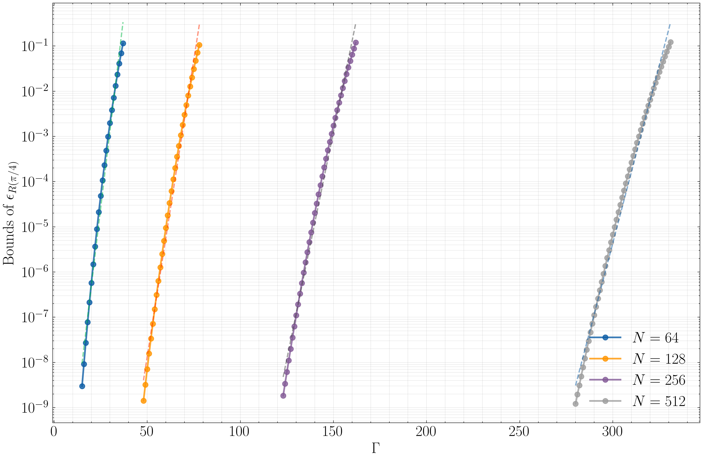
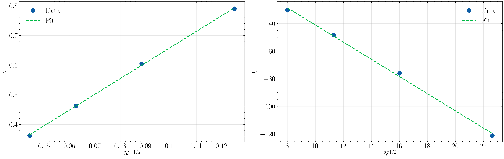

**Per-N linear fits** `log(ε) = a·Γ + b`:

| N | a | b |
|---|---|---|
| 64 | 7.9012e-01 | -30.3194 |
| 128 | 6.0439e-01 | -48.3411 |
| 256 | 4.6245e-01 | -76.0432 |
| 512 | 3.6266e-01 | -121.1401 |

**Coefficient scaling**: a ≈ 5.2939·N⁻¹/² +0.1313  (R²=0.9996),  b ≈ -6.2265·N¹/²  +21.2313  (R²=0.9975)

## Squeezing S(1) Error

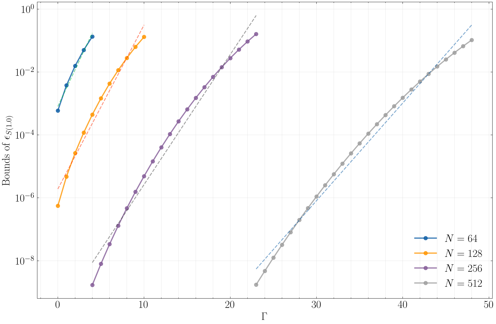
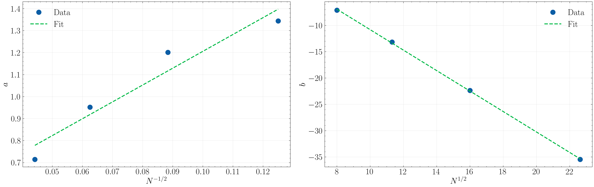

**Per-N linear fits** `log(ε) = a·Γ + b`:

| N | a | b |
|---|---|---|
| 64 | 1.3438e+00 | -7.1189 |
| 128 | 1.2010e+00 | -13.1644 |
| 256 | 9.5212e-01 | -22.3610 |
| 512 | 7.1458e-01 | -35.4567 |

**Coefficient scaling**: a ≈ 7.6584·N⁻¹/² +0.4400  (R²=0.9346),  b ≈ -1.9439·N¹/²  +8.6329  (R²=0.9998)

## Beam Splitter BS(π/2) Error

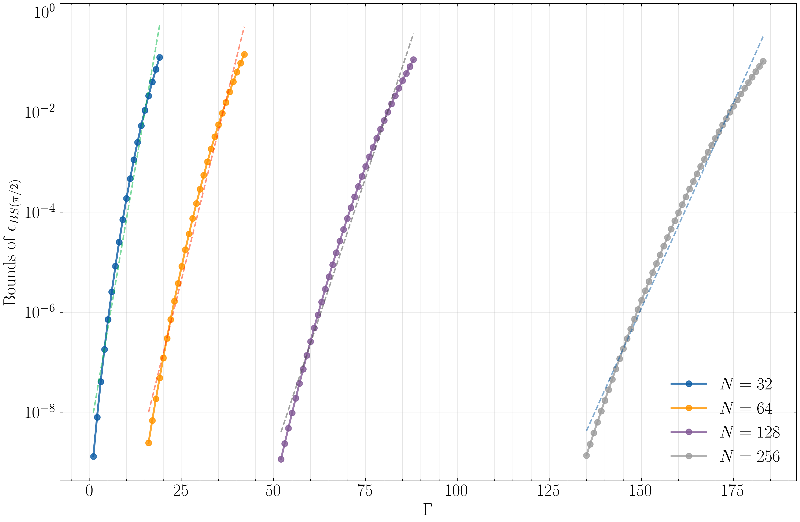
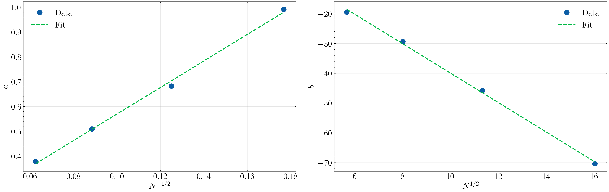

**Per-N linear fits** `log(ε) = a·Γ + b`:

| N | a | b |
|---|---|---|
| 32 | 9.9185e-01 | -19.4469 |
| 64 | 6.8264e-01 | -29.3452 |
| 128 | 5.0967e-01 | -45.8362 |
| 256 | 3.7813e-01 | -70.3308 |

**Coefficient scaling**: a ≈ 5.3456·N⁻¹/² +0.0356  (R²=0.9969),  b ≈ -4.9546·N¹/²  +9.5080  (R²=0.9985)

## Compare Fock vs WF Encoding

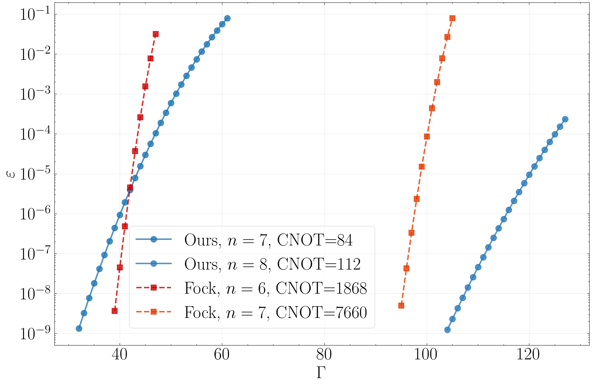

## Advantage Diagram

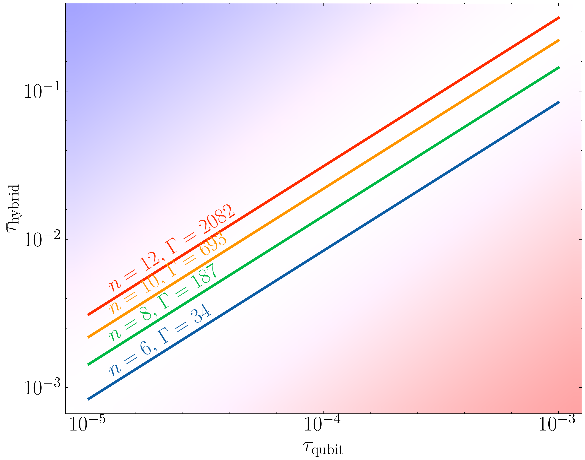

