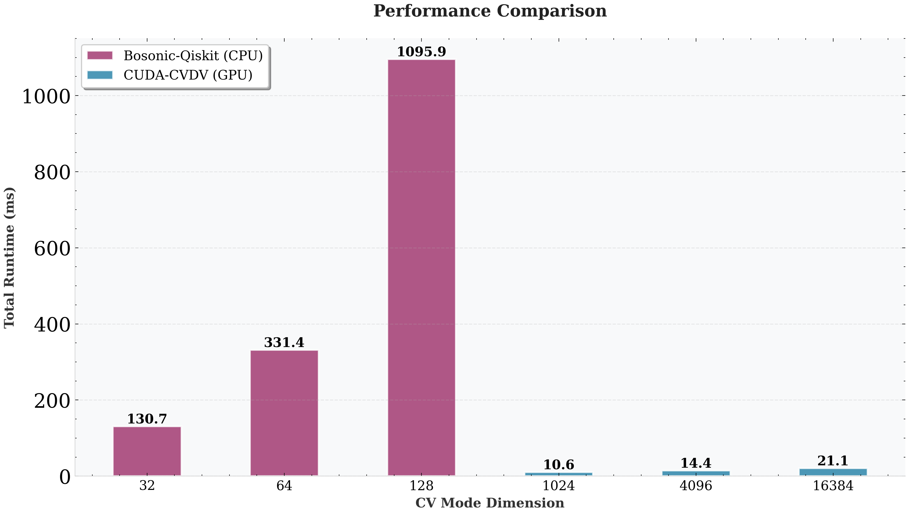
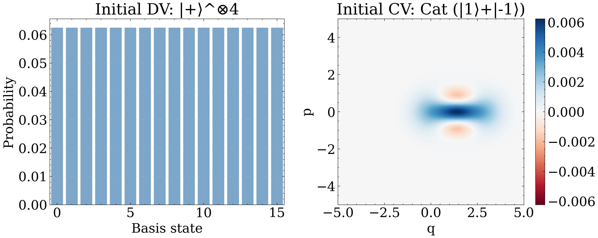
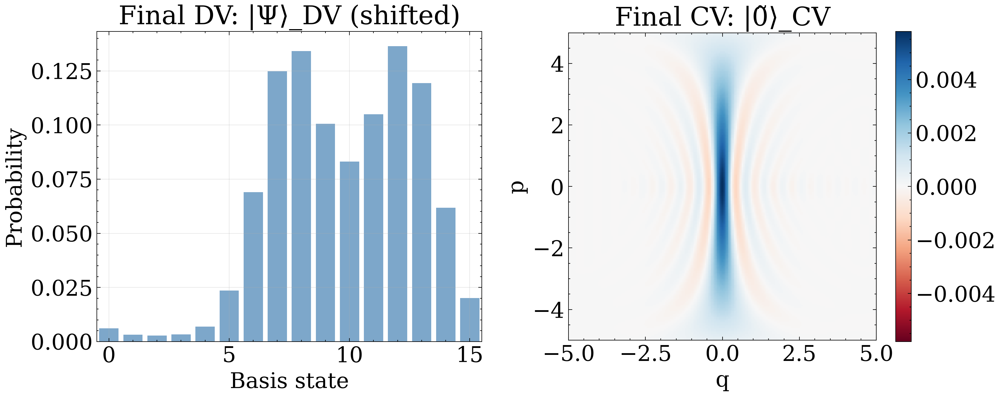

# CUDA-CVDV: CUDA-Accelerated Hybrid CV-DV Quantum Simulator

A high-performance CUDA library for simulating hybrid continuous-variable (CV) and discrete-variable (DV) quantum systems using position wave function encoding.

> **Reference**: This project demonstrates classical simulation techniques from **"Efficient Qubit Simulation of Hybrid Oscillator-Qubit Quantum Processors"** ([arXiv:xxxx.xxxxx](https://arxiv.org/abs/xxxx.xxxxx)), which establishes qubit circuits for simulating hybrid CV-DV processors. While the paper focuses on quantum simulation, this CUDA implementation shows the potential for efficient classical dense state vector simulation of hybrid systems.

## Todo List

+ [ ] Add example notebooks for Product Formula and QSP
+ [ ] Implement more efficient CUDA kernels for FFT, Wigner function and Husimi Q function
+ [x] Add visual examples to README (Wigner function plots, architecture diagram)
+ [x] Create unit test suite with pytest for core operations
+ [x] Add performance benchmarks (timing, memory usage, GPU vs CPU comparison) + comparison table vs existing bosonic simulators


## Benchmarks: CV-to-DV State Transfer

The position encoding approach naturally enables **universal transfer of CV modes into qubits**, where the position wave function coefficients $\psi(q_j)$ are directly encoded into the qubit register amplitudes. This capability is demonstrated through the **CV-to-DV state transfer protocol** [Phys. Rev. Lett. 128, 110503 (2022)](https://link.aps.org/doi/10.1103/PhysRevLett.128.110503).

**How it works**: The algorithm transfers a CV state's position-space representation into a discrete qubit register:
$$|\psi\rangle_{\text{CV}} = \int \psi(q) |q\rangle \, dq \mapsto \sqrt{\lambda} \sum_{j=0}^{N-1} \psi(\lambda\tilde{j}) |j\rangle_{\text{DV}},$$

where $\lambda = \sqrt{2\pi/N}$ is the grid spacing and $\tilde{j} = j - (N-1)/2$ is the shifted index.

### Performance Comparison (Tested on NVIDIA RTX 4070 Laptop GPU)

The benchmark compares CUDA-CVDV (GPU, position encoding) against bosonic-qiskit (CPU, Fock basis) across varying CV dimensions:



*Performance scaling with CV dimension. CUDA-CVDV efficiently simulates up to dimension **16384** (14 qubits) on GPU with **50×** speedup over bosonic-qiskit at dimension **128** (7 qubits). Bosonic-qiskit's runtime scales up significantly beyond dimension 128 due to dense matrix operations.*

### Run Benchmarks

```bash
./benchmarks/run.sh
```

Results saved to `benchmarks/results/` with timing data (`benchmark_results.json`) and visualization plots.

### Visualization

The benchmark demonstrates transferring a cat state from a CV mode to a 4-qubit register:

**Initial State**



**Final State**




## Why Position Wave Function Encoding?

### The Problem with Fock Basis

Traditional CV quantum simulators use **Fock basis** encoding $|\psi\rangle = \sum_n c_n |n\rangle$, which presents fundamental computational challenge that Gaussian operations (displacement, squeezing, beam splitters) have **dense, non-sparse matrix representations**

### Position Wave Function Advantages

**This codebase encodes CV states by sampling the position wave function** $\psi(q)$ on a discrete grid:

$$|\psi\rangle \mapsto \sqrt{\lambda} \sum_{j=0}^{N-1} \psi(\lambda \tilde{j}) |j\rangle$$

where $\tilde{j} = j - (N-1)/2$ is the shifted index and $\lambda = \sqrt{2\pi/N}$ is the grid spacing.

This encoding offers:

1. **Exact Position-Space Operations**: Operators of the form $e^{it\hat{q}}$ and $e^{it\hat{q}^2}$ are **diagonal** in position encoding—implemented as simple phase multiplications with zero error
2. **Efficient Gaussian Gates**: Displacement, squeezing, rotation, and beam splitters decompose into elementary $e^{it\hat{q}_j\hat{q}_k}$ and $e^{it\hat{p}_j\hat{p}_k}$ operations, each requiring only $O(n^2)$ elementary gates
3. **Controlled Error Source**: Errors arise **only** from QFT basis switching between position and momentum representations—not from Trotter or other approximations
4. **CUDA-Friendly Parallelism**: Each grid point is processed independently, achieving near-optimal GPU utilization

## Data Format

### Register-Based Architecture

CUDA-CVDV uses a unified **register abstraction** where all quantum systems are discrete registers with dimension $2^n$:

```
Register 0: 2^numQubits[0] levels
Register 1: 2^numQubits[1] levels
...
```

The full state vector is the tensor product of all registers:
$$|\Psi\rangle = |\psi_0\rangle \otimes |\psi_1\rangle \otimes \cdots$$

### Grid Discretization

For CV operations, the position-space grid is automatically configured:
- Grid dimension: $\text{N} = 2^n$
- Grid step: $dx = \sqrt{2\pi / N}$
- Position range: $x \in [-\sqrt{\pi N/2}, \sqrt{\pi N/2}]$

## Installation

### Requirements

- CUDA Toolkit (tested with 13.1)
- CMake >= 3.18
- Python 3

GPU architecture defaults to `89` (Ada Lovelace). Override with `-DCMAKE_CUDA_ARCHITECTURES=XX` if using a different GPU. The Python wrapper automatically rebuilds on import.

## Project Structure

```
src/
  cvdv.cu              # CUDA implementation (kernels + C API)
interface.py           # Python ctypes wrapper (CVDV class)
tests/
  test_core.py         # Automated test suite (pytest)
examples/
  cvdv_transfer.ipynb  # CV-DV state transfer demo
  qcst.ipynb           # Quantum coherent state transform demo
test.ipynb             # Interactive testing notebook
CMakeLists.txt         # Build configuration
Makefile               # Build & test commands
run.sh                 # Build script (creates build/libcvdv.so)
.pre-commit-config.yaml # Pre-commit hook configuration
```

## Usage

### Basic Example

```python
from interface import CVDV

# Create system with two registers: 1 qubit + 10-qubit CV mode
sim = CVDV([1, 10])  # Register 0: 2 levels, Register 1: 1024 grid points

# Initialize states
sim.setZero(0)       # |0⟩ for qubit
sim.setCoherent(1, 2+1j)  # Coherent state |α=2+i⟩

# Build tensor product state (REQUIRED before operations)
sim.initStateVector()

# Apply operations
sim.hadamard(0, 0)           # Hadamard on qubit
sim.cd(1, 0, 0, 1.5)         # Conditional displacement
sim.displacement(1, -1+0.5j) # Unconditional displacement

# Visualize
wigner = sim.getWignerSingleSlice(1, [-1], wignerN=201, wXMax=5, wPMax=5)
```

### Initialization Pattern

**Critical**: Follow this 3-step pattern:

1. **Create** instance with register sizes
2. **Initialize** each register (`setZero`, `setCoherent`, `setFock`, `setFocks`, `setUniform`)
3. **Build** tensor product with `initStateVector()`

### Available Operations

| Category | Operations |
|----------|------------|
| **CV Gates** | `displacement(α)` ($e^{\alpha\hat{a}^\dagger - \alpha^*\hat{a}}$), `squeeze(r)` ($e^{r(\hat{a}^2 - \hat{a}^{\dagger 2})/2}$), `rotation(θ)` ($e^{i\theta \hat{a}^\dagger \hat{a}}$), `sheer(t)` ($e^{it\hat{q}^2/2}$) |
| **DV Gates** | `hadamard()` ($H$), `pauliRotation(axis, θ)` (axis=0,1,2: $R_x(\theta), R_y(\theta), R_z(\theta)$) |
| **Hybrid** | `cd(α)` ($e^{Z(\alpha\hat{a}^\dagger - \alpha^*\hat{a})}$) |
| **Two-Mode** | `beamSplitter(θ)`, `q1q2(coeff)` ($e^{i t \hat{q}_1 \hat{q}_2}$), `swapRegisters()` |
| **Transforms** | `ftQ2P()`, `ftP2Q()` (Fourier transforms) |
| **Measurement** | `measure()`, `jointMeasure()`, `getState()` |
| **Visualization** | `getWignerSingleSlice()`, `getWignerFullMode()`, `getHusimiQFullMode()` |

## Example Notebooks

| Notebook | Description |
|----------|-------------|
| [examples/cvdv_transfer.ipynb](examples/cvdv_transfer.ipynb) | CV-to-DV state transfer protocol [arXiv:2106.12272](https://arxiv.org/abs/2106.12272) |
| [examples/qcst.ipynb](examples/qcst.ipynb) | Quantum coherent state transform [arXiv: 2412.12871](https://arxiv.org/abs/2412.12871) |

## Testing

This project uses **pytest** for automated testing. Tests require a CUDA-capable GPU.

### Run Tests

```bash
make test          # Build CUDA library and run all tests
make build         # Build CUDA library only
make clean         # Remove build artifacts
```

### Pre-commit Hooks

Install pre-commit hooks to automatically run tests before each commit:

```bash
pip install pre-commit
pre-commit install
```

Now tests run automatically on every `git commit`!

### Test Suite

The test suite (`tests/test_core.py`) validates correctness using **inner product checks** between computed and theoretical states:

- State initialization (vacuum, coherent, Fock)
- CV operations (displacement, rotation, squeezing)
- DV operations (Hadamard, Pauli rotations)
- Hybrid operations (conditional displacement)
- Multi-register systems (beam splitter)
- Fourier transform reversibility
- State normalization preservation

## Debugging

Debug logs are written to `cuda.log` in the project root (cleared on each `CVDV()` instantiation).

## License

MIT License

Xi Lu
