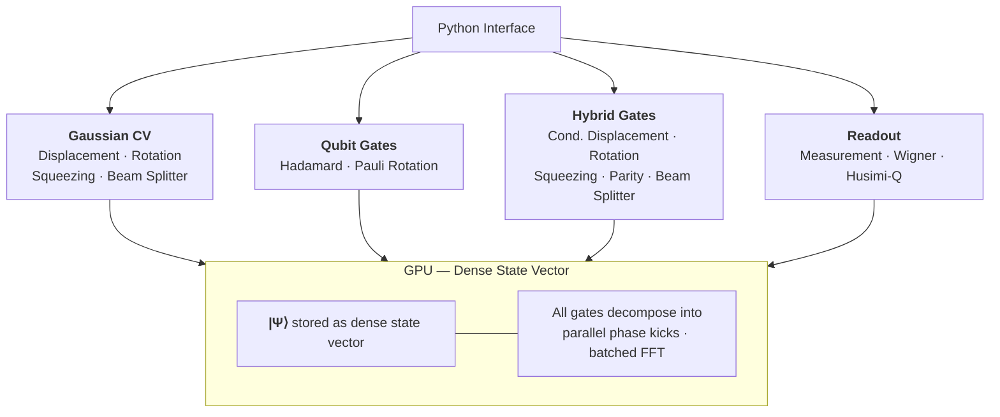

# CUDA-CVDV: CUDA-Accelerated Hybrid CV-DV Quantum Simulator

A high-performance CUDA library for simulating hybrid continuous-variable (CV) and discrete-variable (DV) quantum systems using position wave function encoding.

> **Reference**: This project demonstrates classical simulation techniques from **"Efficient Qubit Simulation of Hybrid Oscillator-Qubit Quantum Processors"** ([arXiv:2603.09233](https://arxiv.org/abs/2603.09233)), which establishes qubit circuits for simulating hybrid CV-DV processors. While the paper focuses on quantum simulation, this CUDA implementation shows the potential for efficient classical dense state vector simulation of hybrid systems.

## Todo List

- **Kernel optimizations** — profile first with Nsight (`docs/CONTRIBUTING.md`)
  - [ ] Vectorized loads (`__ldg()` / `double2`) for phase-multiplication kernels
  - [ ] Coalescing audit on strided-register kernels (`kernelApplyOneModeQ` and variants)
  - [ ] Register-accumulator tiling for Wigner integrand kernel (`kernelBuildWignerIntegrand`)
  - [ ] L2 cache set conflicts on strided accesses — register strides are powers of two (2^10 = 1024 elements), which can cause multiple streams to alias to the same L2 sets and thrash; fix via array padding or access reordering

- **Packaging**
  - [ ] Add example notebooks for Product Formula and QSP

- **Autograd support**
  - [ ] Implement automatic differentiation for quantum circuit parameters

- [x] Wigner and Husimi Q CUDA kernels
- [x] Unit test suite (core + CUDA/Torch consistency)
- [x] Performance benchmarks vs bosonic-qiskit
- [x] `CVDV_DEV` flag for dev mode (rebuild on import)
- [x] CPU fallback via `torch-cpu` backend
- [x] Optional-dep packaging (`pyproject.toml` extras)

## Performance Summary

Tested on NVIDIA RTX 4070 Laptop GPU — **50× speedup** over bosonic-qiskit at CV dimension 128 (7 qubits), scaling efficiently to dimension 16384 (14 qubits).

See [BENCHMARKS.md](BENCHMARKS.md) for full results, plots, and gate-level timing.


## Why Position Wave Function Encoding?

### The Problem with Fock Basis

Traditional CV simulators use **Fock basis** encoding $|\psi\rangle = \sum_n c_n |n\rangle$: Gaussian operations (displacement, squeezing, beam splitters) have **dense, non-sparse matrix representations**, making them expensive.

### Position Wave Function Advantages

**This codebase encodes CV states by sampling the position wave function** $\psi(q)$ on a discrete grid:

$$|\psi\rangle \mapsto \sqrt{\lambda} \sum_{j=0}^{N-1} \psi(\lambda \tilde{j}) |j\rangle$$

where $\tilde{j} = j - (N-1)/2$ is the shifted index and $\lambda = \sqrt{2\pi/N}$ is the grid spacing.

This encoding offers:

1. **Exact Position-Space Operations**: Operators $e^{it\hat{q}}$ and $e^{it\hat{q}^2}$ are **diagonal** — implemented as element-wise phase multiplications with zero error
2. **Efficient Gaussian Gates**: Displacement, squeezing, rotation, and beam splitters decompose into elementary $e^{it\hat{q}_j\hat{q}_k}$ and $e^{it\hat{p}_j\hat{p}_k}$ operations
3. **Controlled Error Source**: Errors arise **only** from QFT basis switching — not from Trotter or other approximations
4. **CUDA-Friendly Parallelism**: Each grid point is processed independently, achieving near-optimal GPU utilization


## Architecture


```mermaid
graph TD
    API[Python Interface]

    API --> G["<b>Gaussian CV</b><br/>Displacement · Rotation<br/>Squeezing · Beam Splitter"]
    API --> DV["<b>Qubit Gates</b><br/>Hadamard · Pauli Rotation"]
    API --> HY["<b>Hybrid Gates</b><br/>Cond. Displacement · Rotation<br/>Squeezing · Parity · Beam Splitter"]
    API --> RO["<b>Readout</b><br/>Measurement · Wigner · Husimi-Q"]

    G & DV & HY & RO --> S

    subgraph S["GPU — Dense State Vector"]
        PSI["<b>|Ψ⟩</b> stored as dense state vector"]
        OPS["All gates decompose into<br/>parallel phase kicks · batched FFT"]
        PSI --- OPS
    end
```


## Project Structure

```
src/
  cvdv.cu              # CUDA kernels + C API (~2500 lines, 30+ kernels)
  __init__.py          # Python ctypes wrapper (CVDV class)
  separable.py         # Separable state helpers
tests/
  test_core.py         # Core operation tests (inner product checks)
  test_consistency.py  # CUDA vs Torch consistency tests
examples/
  state_transfer.ipynb # CV-DV state transfer demo
  qcst.ipynb           # Quantum coherent state transform demo
benchmarks/
  state_transfer/      # CV-to-DV state transfer vs bosonic-qiskit
profiling/             # Nsight profiling scripts + CSV comparison tool
analysis/              # Error analysis scripts (gate errors, Trotter bounds)
CMakeLists.txt         # Build configuration
Makefile               # Build & test commands
```


## Getting Started

### 1. Clone and build

```bash
git clone https://github.com/your-org/cuda-cvdv.git
cd cuda-cvdv
make build          # compiles build/libcvdv.so against your GPU
```

**Requirements:** CUDA Toolkit ≥ 11, CMake ≥ 3.18, Python 3.8+.
The build targets your GPU architecture automatically (`CMAKE_CUDA_ARCHITECTURES=native`). To cross-compile: `cmake -DCMAKE_CUDA_ARCHITECTURES=86 ..`.

### 2. Install as a Python library

```bash
pip install .                  # core (numpy only)
pip install ".[torch]"         # + torch-cuda / torch-cpu backends
pip install ".[torch,viz]"     # + plotting (matplotlib, scienceplots)
```

### 3. Use in any Python project

```python
import sys
sys.path.insert(0, "/path/to/cuda-cvdv")   # or add to PYTHONPATH
```

Or install into your project's virtualenv with `pip install /path/to/cuda-cvdv`.

```python
from src import CVDV
from src.separable import SeparableState

sep = SeparableState([1, 10])
sep.setZero(0)
sep.setCoherent(1, 2 + 1j)

sim = CVDV([1, 10], backend='cuda')
sim.initStateVector(sep)
sim.cd(1, 0, 0, 1.5)
wigner = sim.getWigner(1, bound=5.0)
```

By default, no rebuild is attempted on import. Set `CVDV_DEV=1` to enable automatic `make build` on each import (useful during kernel development):

```bash
CVDV_DEV=1 python your_script.py
```

### No GPU? Use the CPU backend

```bash
pip install ".[torch]"
```

```python
sim = CVDV([1, 10], backend='torch-cpu')   # no CUDA, no .so needed
```

See [docs/api.md](docs/api.md) for the full API reference and [docs/CONTRIBUTING.md](docs/CONTRIBUTING.md) for the development workflow.


## Docs

| Document | Contents |
|----------|----------|
| [docs/api.md](docs/api.md) | Full API reference — all classes, methods, normalization conventions |
| [docs/CONTRIBUTING.md](docs/CONTRIBUTING.md) | Dev setup, build flags, adding kernels, Nsight profiling |
| [BENCHMARKS.md](BENCHMARKS.md) | Performance plots and gate-level timing |

## Example Notebooks

| Notebook | Description |
|----------|-------------|
| [examples/state_transfer.ipynb](examples/state_transfer.ipynb) | CV-DV state transfer [Phys. Rev. Lett. 128, 110503 (2022)](https://link.aps.org/doi/10.1103/PhysRevLett.128.110503) |
| [examples/qcst.ipynb](examples/qcst.ipynb) | Quantum coherent state transform [arXiv:2412.12871](https://arxiv.org/abs/2412.12871) |


## License

MIT License — Xi Lu
